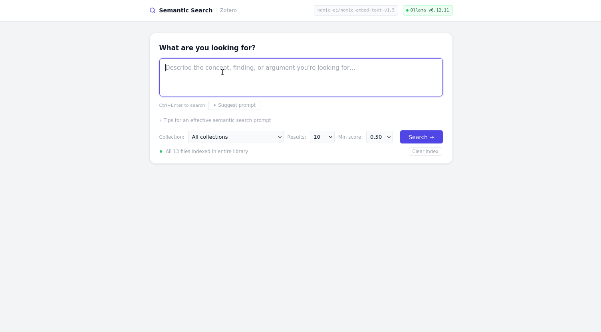
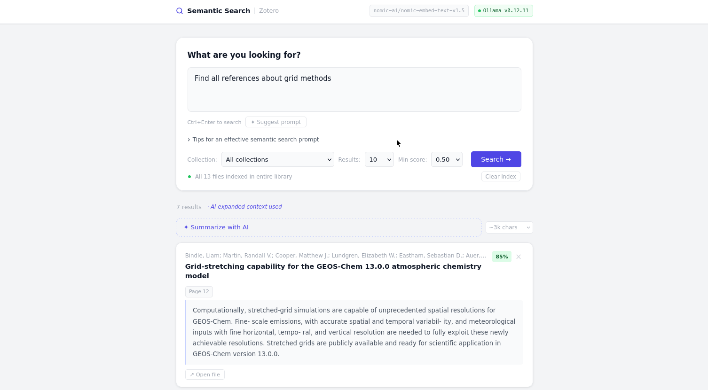

# Zotero Semantic Search

**Semantic search and AI summaries for your Zotero library — fully offline.**

 [](https://www.gnu.org/licenses/agpl-3.0)



Zotero Semantic Search indexes your Zotero library using dense vector embeddings and lets you search by meaning rather than keywords. An optional local LLM synthesises a cited summary from the matching papers — all processing happens on your machine with no data leaving your network.

---

## Features

- **Semantic search** — find papers by concept, not just keyword match; uses [nomic-embed-text-v1.5](https://huggingface.co/nomic-ai/nomic-embed-text-v1.5) (768-dim, 8192-token context)
- **AI summaries** — after a search, generate a cited synthesis of the visible results using a local LLM via [Ollama](https://ollama.com)
- **HyDE retrieval** — the LLM first drafts a hypothetical matching passage, then searches by that embedding for higher-quality results
- **Fully offline** — no API keys, no cloud services; the Docker image ships with all models baked in and network egress is disabled at the container level
- **Collection-scoped search** — filter by any Zotero collection; indexing runs on-demand for only the selected collection
- **Incremental indexing** — only unindexed files are embedded on each search; PDFs, DOCX, PPTX, XLSX, HTML, RTF, and more are supported

---

## Screenshots

### Semantic search across your library


### AI summary with cited references


---

## Installation

Zotero Semantic Search runs inside Docker, so the only thing you need to install is Docker itself. Supported platforms: **Linux** (x86-64), **macOS** (Intel and Apple Silicon), **Windows**.

### Step 1 — Install Docker Desktop

| Platform | Download |
|---|---|
| macOS | [Docker Desktop for Mac](https://www.docker.com/products/docker-desktop/) |
| Windows | [Docker Desktop for Windows](https://www.docker.com/products/docker-desktop/) (requires WSL2 — the installer sets this up) |
| Linux | [Docker Engine](https://docs.docker.com/engine/install/) + [Docker Compose plugin](https://docs.docker.com/compose/install/) |

### Step 2 — Create a `docker-compose.yml` file

Create a new folder anywhere on your computer and save the following as `docker-compose.yml` inside it:

```yaml
services:
  zotero-search:
    image: ghcr.io/your-username/zotero-semantic-search:latest
    ports:
      - "8000:8000"
    volumes:
      - ~/Zotero:/zotero:ro
      - chroma-data:/data/chroma
    cap_add:
      - NET_ADMIN
    restart: unless-stopped

volumes:
  chroma-data:
```

This assumes your Zotero library is in the default location (`~/Zotero` on macOS/Linux, `%USERPROFILE%\Zotero` on Windows — Docker resolves `~` correctly on all platforms).

**macOS only:** Docker Desktop on macOS may not support the `NET_ADMIN` capability required for network isolation. If the container fails to start, add the following under the service and read [Privacy & Network Isolation](#privacy--network-isolation) to understand what this trades away:

```yaml
    environment:
      - DISABLE_NETWORK_ISOLATION=1
```

### Step 3 — Start the app

Open a terminal in the folder containing `docker-compose.yml` and run:

```bash
docker compose up
```

The first run will pull the image (~5–6 GB). Once running, open **http://localhost:8000** in your browser.

The first search against a collection will trigger indexing for any unindexed files. Subsequent searches are fast.

> **Offline by design:** see [Privacy & Network Isolation](#privacy--network-isolation) for details on how outbound traffic is blocked.

### Building from source

If you'd prefer to build the image yourself (e.g. to use different models):

```bash
git clone https://github.com/your-username/zotero-semantic-search.git
cd zotero-semantic-search
docker compose build   # ~10 min first time — downloads models into the image
docker compose up
```

---

## Privacy & Network Isolation

This tool is designed for use with private document libraries. Two independent layers prevent data from leaving the container:

**1. iptables egress block (hard enforcement)**

The container entrypoint installs iptables rules before any process starts:

```
OUTPUT -o lo          → ACCEPT   # loopback: app ↔ Ollama on localhost
OUTPUT ESTABLISHED    → ACCEPT   # allow responses to inbound connections (port 8000)
OUTPUT (everything else) → DROP  # block all new outbound connections
```

This is enforced at the Linux kernel level inside the container's network namespace. No process — regardless of what library it uses or what code it runs — can initiate a new outbound TCP/UDP connection. The `NET_ADMIN` capability in `docker-compose.yml` grants permission to set these rules without requiring a fully privileged container.

**2. Telemetry opt-out environment variables (defence in depth)**

The following variables are set automatically by the pixi environment activation (in `pyproject.toml`) and therefore apply both inside Docker and during local development:

| Variable | Library |
|---|---|
| `HF_HUB_OFFLINE=1` | fastembed — prevents HuggingFace Hub model update checks |
| `TRANSFORMERS_OFFLINE=1` | HuggingFace Transformers offline mode |
| `ANONYMIZED_TELEMETRY=false` | ChromaDB telemetry |
| `OLLAMA_NO_ANALYTICS=1` | Ollama usage analytics |
| `DO_NOT_TRACK=1` | General opt-out signal honoured by some tools |

All model weights (embedding model and LLM) are downloaded into the Docker image at build time, so the running container has no reason to make any outbound requests.

**Docker Desktop on macOS / Windows**

On Linux hosts the iptables rules are applied at startup and the container will refuse to start if they fail. On Docker Desktop (macOS or Windows), `NET_ADMIN` may not be available depending on your version and settings. If the container fails to start, you can disable the iptables block by setting `DISABLE_NETWORK_ISOLATION=1` in `docker-compose.yml`:

```yaml
environment:
  - DISABLE_NETWORK_ISOLATION=1
```

With this set, egress is not blocked at the kernel level — only the telemetry opt-out env vars apply. Do not use this on a Linux host where you want hard isolation.

**Verifying isolation**

To confirm the egress block is active, you can run a connectivity test from inside the container:

```bash
docker compose exec zotero-search curl -s --max-time 5 https://example.com
# Expected: curl: (28) Connection timed out  (or immediate drop, not a response)
```

---

## Local Development (without Docker)

Requires [pixi](https://pixi.sh).

```bash
pixi run dev          # live-reload dev server on http://localhost:8000
pixi run app          # production-like server on http://127.0.0.1:8000
pixi run delete-index # wipe the local ChromaDB index
```

Ensure Ollama is running separately (`ollama serve`) if you want AI features. Telemetry opt-outs are applied automatically by the pixi environment activation.

---

## Configuration

The following environment variables can be set in `docker-compose.yml` to override defaults:

| Variable | Default | Description |
|---|---|---|
| `ZOTERO_DB` | `/zotero/zotero.sqlite` | Path to your Zotero SQLite database |
| `ZOTERO_STORAGE` | `/zotero/storage` | Path to your Zotero attachment storage |
| `CHROMA_PATH` | `/data/chroma` | Where ChromaDB persists the vector index |
| `OLLAMA_URL` | `http://localhost:11434` | Ollama API endpoint |
| `OLLAMA_MODEL` | `llama3.2` | LLM used for HyDE, query expansion, and summaries |
| `EMBED_MODEL` | `nomic-ai/nomic-embed-text-v1.5` | fastembed embedding model |

To build the image with different models baked in:

```bash
docker compose build \
  --build-arg OLLAMA_MODEL=llama3.1:8b \
  --build-arg EMBED_MODEL=nomic-ai/nomic-embed-text-v1.5
```

---

## How It Works

```
Query
  │
  ├─ Ollama (HyDE) ──► hypothetical passage ──► embed ──► ChromaDB query
  │                                                              │
  └─ (fallback) ──────────────────────────► embed ──► ChromaDB query
                                                              │
                                                         ranked results
                                                              │
                                                    Ollama (summary) ──► streamed response
```

1. **Indexing** — attachments are extracted to text chunks (~2000 chars each), embedded with fastembed, and stored in a ChromaDB cosine-similarity collection
2. **Search** — the query (or a LLM-generated hypothetical document) is embedded and the nearest chunks are retrieved; results are deduplicated to one card per paper
3. **Summary** — visible result cards are sent to Ollama with a source-citation prompt; tokens stream back via Server-Sent Events

---

## License

This project is licensed under the [GNU Affero GPL v3.0 (AGPL)](LICENSE).
